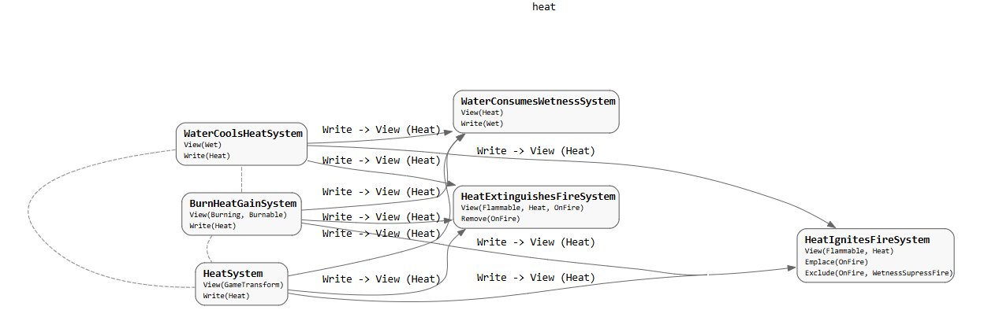

---

title: "Better ECS Systems for Emergent Design"

date: 2026-06-20

excerpt: "An introduction to my C++ simulation engine design for emergent NPC behaviour and physical material based gameplay."

tags: ["Simulation Engine", "C++", "ECS", "Architecture"]

---

The overall intention of the simulation engine is to enable emergent behaviour from simple building blocks. ECS offers to simplify this goal in the most directly accessible way.

The following paragraphs explain some of the important layers of the architecture. Tldr; Components define the core properties of the world. Systems define how those properties interact. Systems are constrained by enforced compile-time rules to prevent mis-use.

With components I can define those simple building blocks with efficient memory allocation. The simulation at its core will be defined by what our physics is defined by. There is a limit, of course. I will not explain how deep these components will describe my world yet, but it's enough to say that they will define the nature of the world and suffice for emergent interaction.

The second part of this architecture are the systems. While the components remain small and define the building blocks, I determined that the systems should remain small and only define a common interaction. While I have not gone for pure ECS in the most typical sense, I am approaching a similar concept by maintaining thin systems. This will make them easier to debug and manage, while offering a robust solution at scale. The systems will also be prevented from communicating directly with one another. Soon I will discuss the structure of these systems, but for now imagine them as singular functions defining how one component interacts with another (or multiple) in the world.

The last part of the architecture defines a layer of development and control preventing deviation from the system specifications. This part is especially important for maintaining the systems as they grow. This involves compile time constraints in c++ as well as the occasional runtime constraint when the compiler cannot efficiently handle it. I will reserve the bulk of these systems for a potential future post.

Lets go over some more specific examples of the architecture.

```cpp
#pragma once

#include <entt/entt.hpp>

struct AffectEvent {
    float arousal;
    float valence;
    float timestamp; // Time when the event occurred, in seconds since the start of the game.
    float salience; // 0 to 1, how important this event is to the character's overall affinity state.
    std::vector<entt::entity> entity_ids; // IDs of entities involved in the event, if any.
};
```
This snippet represents the overall emotional state of an NPC when an event occurs in the world. This could be a noise, salient visual cue, or a direct change based on an interaction with another NPC. It is a good example to showcase the limits of a component. As represented, the component required multiple fields to describe what it is. The concepts of Arousal/Activation and Valence in Affect to describe a persons entire emotional state can be found by Lisa Feldman Barrett in her works: [Affect as a Psychological Primitive - PubMed](https://pubmed.ncbi.nlm.nih.gov/20552040/).

The core root of designing these components lies in the nature of systems. If I have too many fields, systems will be required to handle more logic than necessary. If I split the component into single field components, the number of components required to be included by a system increases drastically introducing complexity. The core constraint is that components must include the least amount of fields, except when all systems would need to operate continuously on the same collection of fields. The AffectEvent component represents an efficient example of this since the systems that utilize it will need to access both arousal and valence to operate appropriately on it. If we split those fields, it would require gathering both at the same time to either set, or access them like when testing the salience of a memory.

Keeping components efficient is the core of the systems architecture. The following is an example of a system and the bounds it is constrained by.

```cpp
#include "integrity_system.hpp"

#include "components/properties/integrity_component.h"

System IntegritySystem = makeSystem<
    View<Integrity>,
    DestroysEntities>(
    [](auto view, float deltaTime)
    {
        // Collect entities with zero integrity
        std::vector<entt::entity> entitiesToDestroy;

        for (auto entity : view) {
            const auto& integrity = view.read<Integrity>(entity);
            if (integrity.value <= 0.0f) {
                entitiesToDestroy.push_back(entity);
            }
        }

        // Destroy collected entities
        for (auto entity : entitiesToDestroy) {
            view.destroy(entity);
        }
    }
);

```


The IntegritySystem is an intentionally small system designed to destroy an entity when its integrity collapses. I will mention that this system could be entirely broken down in a more in-depth structure. A door is not defined by a single integrity, but by the fibers of itself. As mentioned earlier, there is a depth-limit. I will avoid creating the entirety of the physical world in a simulation, however I want to represent a world with a fidelity high enough to suspend disbelief. The integrity system could become something greater. Regardless; this system defines only, and exactly, what it needs to do based on one source of logic.

I am defining the system using a generic function `makeSystem<>`. This logic allows me to constrain the system to the components that it defines, but also provides me with a traceable map of the architecture. I may make a post in the future to showcase how I use this to build a visual representation of the project. For now, see [Figure 1](#figure-1) for an example of the heat component and its use in each system completely generated from the generic arguments of `makeSystem<>`.

<figure id="figure-1" class="blog-post-figure-wrap">
  
  <figcaption>Figure 1: Heat component system graph generated from makeSystem generic arguments.</figcaption>
</figure>

As mentioned, the last layer describes what a system can and cannot do. The following code describes the specification of a system and what it is capable of doing:

```cpp
enum class AccessMode {
    Read,
    Write,
    State,
    Remove,
    Emplace,
    DestroysEntities,
    Exclude
};
```

Many of these are enforced characteristics. A system cannot call `view.read<Integrity>` if it does not include `View<Integrity>` as one of the generic arguments. The view object allows for these direct constraints based on the generics present. Not only does this help constrain, but it helps display a graph of what exactly a system touches as seen in [Figure 1](#figure-1).

Based on the infrastructure displayed by using components and systems, I have the capabilities of building physical world like properties within a constrained but powerful environment. Modeling NPC behaviour and physical materials is the start. Resembling these with procedural models, fabricating stories based on NPC knowledge base, and creating a lived-in world are all possible stemming from a simple ECS structure. I look forward to sharing each of these topics through blog posts in the future!
